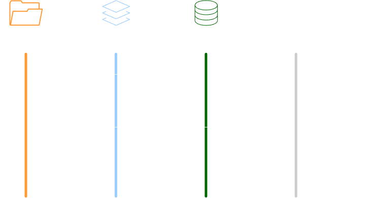
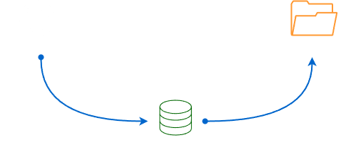

# Git Tutorial

Git[^1] is a fast, scalable, distributed version control system. Git can seem confusing at first, but understanding a few key concepts make it much clearer. In this tutorial, we will walk through the basic git command workflow and clear up some common misconceptions.

<!-- more -->

Before we dive into the commands, lets identify where our code is stored in `git`. The common assumption is that there are only two locations, but code doesn't only exist on GitHub or our local directory.

There are four main locations where our code lives in `git`:

- **Local Working Directory** Where we actively edit files locally
- **Staging Area** Temporary holding spot for changes before committing, also known as the index
- **Local Repository** Where we store committed changes locally
- **Remote Repository** A server like GitHub for sharing and backing up code

# Example Git Flow
Most `git` commands move files between these four locations

- The first step is `git clone` to clone an existing repo so you have a local version of the project to work on complete with all its history. When you start working with a file, you are working in your local directory where you make changes to your code.
- Use `git add` when you are ready to commit changes, to stage a snapshot of those files in the staging area.
- `git commit` takes a snapshot of the staging area and saves it to your local repository. This locks in those staged changes creating a permanent record that you can refer back to like a snapshot in time.
- Your code doesn't just stay on your local machine. When you are ready to share your work with your team, or back up your work, you use `git push` to send your commits to the remote repository. This is often a shared server where your team can collaborate.

## Collaboration in Git

Collaboration in git is a two way exchange. To integrate your teammates work, you use `git pull`, which fetches changes from the remote repository and registers them into your local repository.

`git pull` combines two commands:

- `git fetch` which grabs the latest updates
- `git merge` which integrates these updates with your work

There are times when you need to switch context, perhaps to fix a bug on another branch.

This is where `git checkout`, or `git switch` comes in. It allows you to switch between different branches to work on specific features.

# Git Branching and Merging

Git branching allows you to divert from the main codebase to develop a new feature without impacting the main code.

Some key concepts include creating a new branch with `git branch`, switching between branches using `git switch`, merging branches together with `git merge`, or resolving merge conflicts when changes overlap.

Branching enables isolated development and collaboration workflows and more nuance when merging or rebasing changes from others, or managing branches.

# GUI Tools

Many developers use graphical `git` tools like GitHub Desktop[^2] and Sourcetree[^3]. These tools provide visual interfaces and shortcuts for common commands that can help new users get started with `git` more easily.

## Additional References

[^1]:
    Git for All Platforms. <https://git-scm.com/>
[^2]:
    GitHub Desktop. <https://desktop.github.com/>
[^3]:
    Sourcetree. <https://www.sourcetreeapp.com/>
