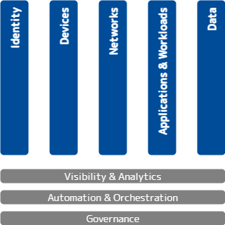
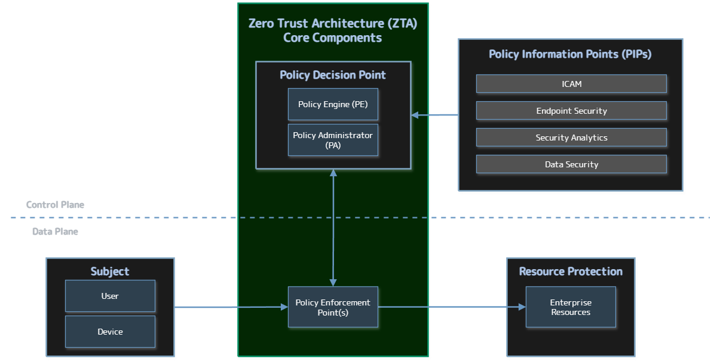
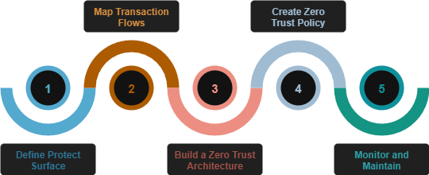

# From A to ZTA: Understanding Zero Trust

Attackers have a strategy, they have a plan.  We know what they are going to be doing, we have modeled these behaviors with MITRE ATTACK and the Killchain concept.  But we know how we traditionally have started to design from the outside, trying to keep them out.  This model, Zero Trust, is all about trying to address the adversary that is already on the network, because we know that's what is happening.

<!-- more -->
Many people are skeptical of zero trust or they will equate it to marketing. And what they are reacting to is a lot of the hype around zero trust that came because the original zero trust papers lived behind a paywall at Forrester, which is a research firm.  Many practitioners were not necessarily clients with Forrester, but every vendor was.  So every vendor would be talking about zero trust and that’s how many practitioners saw zero trust was through the stain-glassed windows of some vendor marketing.

Zero trust is a heavy topic, and I will do my best to breakthrough some of those stereotypes and misconceptions in this article.

## Zero Trust Definition

With any Zero Trust discussion, we need to start by getting the concepts and terminology under our belts so that we are all speaking the same language.

Forrester defines Zero Trust as:[^1]

> Zero Trust is an information security model that denies access to applications and data by default. Threat prevention is achieved by only granting access to networks and workloads utilizing policy informed by continuous, contextual, risk-based verification across users and their associated devices. Zero Trust advocates these three core principles: All entities are untrusted by default; least privilege access is enforced; and comprehensive security monitoring is implemented.

This definition as a security model is critical.  Zero Trust is not a product.  Rather it is a paradigm, or a collection of concepts and ideas to minimize uncertainty in a hostile network.  No single product or vendor will make you "Zero Trust" regardless of what their sales team tells you.

Zero Trust is based on the principle of "never trust, always verify", and aims to solve the inherent problems in placing trust in the network.  

## Core Tenets of Zero Trust

These are the tenets from the NIST special publication on Zero Trust Architecture.  These tenets mirror a lot of the key concepts from the definition above: least privilege, per-session, dynamic, strong authentication and authorization, telemetry, etc.  If you have not done so, I would strongly recommend familiarizing yourself with the concepts in this document.

**NIST SP 800-207 Tenets of Zero Trust:**[^2]

- All data sources and computing services are considered **resources**
- All **communication is secured**, regardless of network location
- Access to individual enterprise resources is granted on a **per-session basis**
- Access to resources is determined by **dynamic policy**, including the **observable state** of client identity, application and the requesting asset, and it may include other behavioral and environmental attributes
- The enterprise monitors and measures the integrity and **security posture** of all owned and associated assets
- All resource **authentication** and **authorization** is dynamic and strictly **enforced before** access is allowed
- The enterprise collects **as much information as possible** about the current state of the network infrastructure and communications and uses it to improve its security posture

800-207 is a descriptive document, not prescriptive.  So it has definitions, tenets, and observed approaches, and details architectural components which we'll get to in a little bit.

## Zero Trust Maturity Models

Because Zero Trust is a strategic approach to cybersecurity, using a maturity model is a logical and effective way for organizations to assess their progress in adopting and implementing its principles. Maturity models aim to assist in the development of zero trust strategies and implementation plans, guiding resource allocation and prioritization, and promoting continuous improvement. Most maturity models for Zero Trust are broken down into 5 or 7 pillars, depending on whose model you are looking at.  

### CISA's Zero Trust Maturity Model (ZTMMv2)

CISA's Zero Trust Maturity Model (ZTMM)[^3], which includes five pillars and three cross-cutting capabilities, is based on the foundations of zero trust. Within each pillar, the maturity model provides specific examples of Traditional, Initial, Advanced, and Optimal zero trust architectures.

The 5 pillars here are: Identity, Devices, Networks, Applications & Workloads, and Data.  

- **Identity**: Focusing on user access management, continuous validation, and behavioral analysis.
- **Devices**: Inventorying, monitoring, and managing the security posture of all devices accessing the network.
- **Networks**: Securing communication regardless of location, with a focus on microsegmentation and encryption.
- **Applications and Workloads**: Securing access to and within applications and services, both on-premises and in the cloud.
- **Data**: Classifying, protecting, and monitoring sensitive data regardless of where it resides.

In the CISA model, you will see that Visibility and Analytics, Automation and Orchestration, and Governance are the foundation of the pillars, or "cross-cutting" capabilities of the pillars.  These capabilities enhance interoperability and effectiveness.

- **Visibility and Analytics**: Gaining insights into network activity, user behavior, and system performance.
- **Automation and Orchestration**: Automating processes and orchestrating responses to security incidents.
- **Governance**: Establishing and enforcing policies for Zero Trust implementation and compliance. 

Some other models will have these foundational layers pulled up as pillars, but these are the core competencies of Zero Trust and are critical when trying to improve maturity of your Zero Trust Architectures.

## Zero Trust Architecture

Zero trust architecture (ZTA) is an enterprise’s cybersecurity plan that utilizes zero trust concepts and encompasses component relationships, workflow planning, and access policies. ZTA enables secure authorized access to enterprise resources that are distributed across on-premises and multiple cloud environments, while enabling a hybrid workforce and partners to access resources from anywhere, at any time, from any device in support of the organization’s mission.

### General ZTA Reference Architecture

In the NIST NCCoE publication *Implementing a Zero Trust Architecture*[^4], we see a high-level representation of the logical components of a ZTA illustrated.  It consists of three types of core components: Policy Engine (PE), Policy Administrator (PA), and Policy Enforcement Point (PEP), as well as several supporting components that assist the policy engine in making its decisions by providing data and policy rules related to areas such as identity, credential, and access management (ICAM); endpoint security; security analytics; data security; and resource protection. This diagram also shows the slicing between the control plane and data plane. 

 

### ZTA Core Components

`Policy Engine (PE)`

: The Policy Engine handles the ultimate decision to grant, deny, or revoke access to a resource for a given subject. The PE calculates the trust scores/confidence levels and ultimate access decisions based on enterprise policy and information from supporting components.

`Policy Administrator (PA)`

: The PA executes the PE’s policy decision by sending commands to the PEP to establish and terminate the communications path between the subject and the resource. It generates any session-specific authentication and authorization token or credential used by the subject to access the enterprise resource.

`Policy Enforcement Point (PEP)`

: The PEP guards the trust zone that hosts one or more enterprise resources. It handles enabling, monitoring, and eventually terminating connections between subjects and enterprise resources. It operates based on commands that it receives from the PA. If an enterprise has highly distributed systems, it may have many PEPs to protect resources in different locations; it may also have multiple PEPs to support load balancing.

`Policy Decision Point (PDP)`

: When combined, the functions of the PE and PA comprise a PDP. The PDP is where the decision as to whether or not to permit a subject to access a resource is made. The PIPs provide various types of telemetry and other information needed for the PDP to make informed access decisions. The PEP is the location at which this access decision is enforced.

### ZTA Supporting Components

ZTA supporting components are integral to other enterprise systems and provide information that the PE uses to make to ZTA policy decisions. The sets of information that are collected by the ZTA supporting components and used as input to ZTA policy decisions are referred to as Policy Information Points (PIPs). ZTA supporting components and policy information fall into the following categories:

- **ICAM**: ICAM components include the strategy, technology, and governance for creating, storing, and managing subject (e.g., enterprise user) accounts and identity records and their access to enterprise resources. Aspects of ICAM include:

    - Identity management
    - Access and credential management
    - Federated identity
    - Identity governance
    - Multi-factor authentication

- **Endpoint Security**

    - Endpoint Detection and Response (EDR)/Endpoint Protection Platform (EPP)

        - Host-based firewall
        - Malware protection
        - Vulnerability/threat mitigation
        - Host intrusion protection

    - Unified endpoint management (UEM)/mobile device management (MDM)

        - Endpoint compliance
        - Application protection
        - Data protection enforcement
  
    - Continuous diagnostics and mitigation (CDM)

- **Data Security**: The data security component includes the policies that an enterprise needs to secure access to enterprise resources, as well as the means to protect data at rest and in transit. Aspects of data security include the following capabilities:

    - Data discovery
    - Data classification, labeling, and sanitization
    - Data encryption
    - Data integrity
    - Data availability
    - Data access protection and exfiltration
    - Auditing and compliance

- **Security Analytics**

    - SIEM
    - SOAR
    - Vulnerability scanning and assessment
    - Network discovery
    - Security controls validation
    - Identity monitoring
    - Security monitoring
    - Application protection and response
    - Cloud access permission manager
    - Security analytics and access monitoring
    - Network monitoring
    - Traffic inspection
    - Endpoint monitoring
    - Threat intelligence
    - User behavior analytics
    - Firmware assurance
    - Centralized management

- **Resource protection**: This category includes build components that do not fit neatly into one of the four supporting component/PIP categories enumerated above. They include components that are deployed on-premises or in the cloud to serve as proxies for a resource or otherwise protect it through monitoring and control, as well as secure desktops and workstations.

    - Application connector
    - Cloud workload protection
    - Cloud security posture management

## ZTA Deployment Approaches

The reference architecture depicted above is intentionally general and is not meant to describe any particular ZTA deployment approach. There are several ways that an enterprise can enact a ZTA for workflows. A full ZT solution will include elements of all three approaches. The approaches include **enhanced identity governance (EIG)**, **microsegmentation**, and **Software Defined Perimeter (SDP)**.

- **Enhanced Identity Governance (EIG)**: This approach uses the identity of actors as the key component of policy creation. Enterprise resource access policies are based on identity and assigned attributes. The primary requirement for 
resource access is based on the access privileges granted to the given subject. 
- **Microsegmentation**: This involves placing individual or groups of resources on a unique network segment protected by a gateway security component. In this approach, the enterprise places infrastructure devices such as intelligent switches (or routers) or next generation firewalls (NGFWs) or special purpose gateway devices to act as PEPs protecting each resource or small group of related resources. Alternatively (or additionally), the enterprise may choose to implement host-based micro-segmentation using software agents or firewalls on the endpoint assets.
- **Software Defined Perimeter**: The last approach uses the network infrastructure to implement a ZTA. This can be achieved by using an overlay network (i.e., layer 7 but also could be set up lower of the OSI network stack). These approaches frequently include concepts from Software Defined Networks (SDN). A common implementation of this includes an agent and resource gateway model that establishes a secure channel used for communication between the client and resource.

## Defining the Zero Trust Protect Surface

A Protect Surface[^6] is the area or portion of an organization’s technology environment that the Zero Trust policy implementation protects. Protect Surfaces consist of Data, Applications, Assets, and Services (DAAS), that is, one or more DAAS elements. Instead of focusing on attack surface, which is an outside in view, this is an inside out view where we start with what we need to protect. Essentially shrinking the attack surface down orders of magnitude to something very small and easily known. 

Sometimes its easy to discover the data elements and assets, but then how do we actually apply the security controls in a way that makes sense to protect what is important? That is where the business information system concept comes in and we can group related elements together. Sometimes there are services that actually service several protect surfaces, e.g. DNS, DHCP, AD, NTP, that can form a protect surface on their own but, we may have an application and a database that go together and they are in their own segment, and they form a business information system.

### Elements Comprising a Protect Surface

DAAS Elements - Data, Applications, Assets, and Services

1. **Data** - The sensitive data that poses the greatest risk if exfiltrated or misused.
2. **Applications** - The applications that use sensitive data or control critical assets.
3. **Assets** - The assets of the organization, including IT, OT, and IoT devices.
4. **Services** - The services and organization most depends on (e.g. DNS, DHCP, NTP, etc.).

A business information system is comprised of one or more DAAS elements. Large business information systems may consist of several smaller subsystems.

### 5 Step Process to Implementation

The 5 step process for implementation allows us to eat the elephant one bite at a time.

1. **Define the Protect Surface**: This is an interative process and be approached one application after another. This also limits impact if something breaks to a single protect surface and supports a change management process.
2. **Map the Transaction and Data Flows**: This is where we're asking "how does the system work together as a system?".
3. **Build a Zero Trust Architecture**: Once we map the flows we need to architect a solution from the inside out. These will be custom to each protect surface as we build our zero trust environment one protect surface at a time.
4. **Create Zero Trust Policy**: This is where we write policy. Everything in security is instantiated in policy.
5. **Monitor and Maintain the Environment** 

## Additional References

[^1]:
    “The Definition of Modern Zero Trust”, David Holmes, Forrester (2022). <https://www.forrester.com/blogs/the-definition-of-modern-zero-trust/>
[^2]:
    NIST Special Publication 800-207: Zero Trust Architecture (2020). <https://nvlpubs.nist.gov/nistpubs/SpecialPublications/NIST.SP.800-207.pdf>
[^3]:
    Zero Trust Maturity Model, Version 2.0.  CISA (2023). <https://www.cisa.gov/sites/default/files/2023-04/zero_trust_maturity_model_v2_508.pdf>
[^4]:
    Implementing a Zero Trust Architecture, NIST NCCoE (2020). <https://www.nccoe.nist.gov/sites/default/files/legacy-files/zta-project-description-final.pdf>
[^5]:
    NIST Special Publication 1800-35: Implementing a Zero Trust Architecture (2025). <https://nvlpubs.nist.gov/nistpubs/SpecialPublications/NIST.SP.1800-35.pdf>
[^6]:
    NSTAC Report to the President on Zero Trust and Trusted Identity Management (2022). <https://www.cisa.gov/sites/default/files/publications/NSTAC%20Report%20to%20the%20President%20on%20Zero%20Trust%20and%20Trusted%20Identity%20Management.pdf>
[^7]:
    CSA Defining the Zero Trust Protect Surface (2024). <https://cloudsecurityalliance.org/artifacts/defining-the-zero-trust-protect-surface>
    