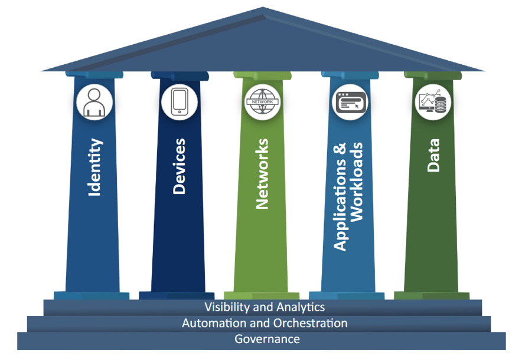
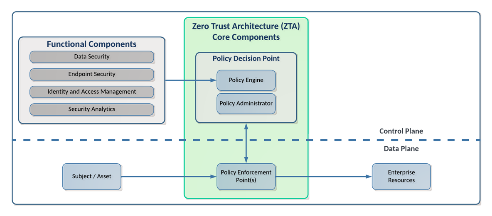

# Demistifying Zero Trust

Attackers have a strategy, they have a plan.  We know what they are going to be doing, we have modeled these behaviors with MITRE ATTACK and the Killchain concept.  But we know how we traditionally have started to design from the outside, trying to keep them out.  This model, Zero Trust, is all about trying to address the adversary that is already on the network, because we know that's what is happening.

<!-- more -->
Many people are skeptical of zero trust or they will equate it to marketing. And what they are reacting to is a lot of the hype around zero trust that came because the original zero trust papers lived behind a paywall at Forrester, which is a research firm.  Many practitioners were not necessarily clients with Forrester, but every vendor was.  So every vendor would be talking about zero trust and that’s how many practitioners saw zero trust was through the stain-glassed windows of some vendor marketing.

Zero trust is a heavy topic, and I will do my best to breakthrough some of those stereotypes and misconceptions in this article.

## Zero Trust Definition

With any Zero Trust discussion, we need to start by getting the concepts and terminology under our belts so that we are all speaking the same language.

Forrester defines Zero Trust as:[^1]

> Zero Trust is an information security model that denies access to applications and data by default. Threat prevention is achieved by only granting access to networks and workloads utilizing policy informed by continuous, contextual, risk-based verification across users and their associated devices. Zero Trust advocates these three core principles: All entities are untrusted by default; least privilege access is enforced; and comprehensive security monitoring is implemented.

This definition as a security model is critical.  Zero Trust is not a product.  Rather it is a paradigm, or a collection of concepts and ideas to minimize uncertainty in a hostile network.  No single product or vendor will make you "Zero Trust" regardless of what their sales team tells you.

Zero Trust is based on the principle of "never trust, always verify", and aims to solve the inherent problems in placing trust in the network.

## Core Tenets of Zero Trust

These are the tenets from the NIST special publication on Zero Trust Architecture.  These tenets mirror a lot of the key concepts from the definition above: least privilege, per-session, dynamic, strong authentication and authorization, telemetry, etc.  If you have not done so, I would strongly recommend familiarizing yourself with the concepts in this document.

**NIST SP 800-207 Tenets of Zero Trust:**[^2]

- All data sources and computing services are considered **resources**
- All **communication is secured**, regardless of network location
- Access to individual enterprise resources is granted on a **per-session basis**
- Access to resources is determined by **dynamic policy**, including the **observable state** of client identity, application and the requesting asset, and it may include other behavioral and environmental attributes
- The enterprise monitors and measures the integrity and **security posture** of all owned and associated assets
- All resource **authentication** and **authorization** is dynamic and strictly **enforced before** access is allowed
- The enterprise collects **as much information as possible** about the current state of the network infrastructure and communications and uses it to improve its security posture

800-207 is a descriptive document, not prescriptive.  So it has definitions, tenets, and observed approaches, and details architectural components which we'll get to in a little bit.

## Zero Trust Maturity Models

Most maturity models for Zero Trust are broken down into 5 or 7 pillars, depending on whose model you are looking at.  CISA's Zero Trust Maturity Model (ZTMM)[^3] uses these 5 pillars which you can see in the image below.

You can see the 5 main pillars here are: identity, Devices, Networks, Applications & Workloads, and Data.  In the CISA model, you will see that Visibility and Analytics, Automation and Orchestration, and Governance are the foundation of the pillars.  Some other models will have these foundational layers pulled up as pillars, but these are the core competencies of Zero Trust and are critical when trying to improve maturity of your Zero Trust Architectures.

## Zero Trust Architecture

This is from the NIST Zero Trust Architecture publication.   It illustrates a high-level representation of the logical components of a ZTA.  This diagram also shows the slicing between the control plane and data plane.

 

In this graphic, we see the core components of the Policy Decision Point and Policy Enforcement Point, and then on the left we have supporting components which are really just different data sources or feeds that support the policy engine.

## Zero Trust Terminology

## Why Zero Trust?

## Additional References

[^1]:
    “The Definition of Modern Zero Trust”, David Holmes, Forrester (2022). <https://www.forrester.com/blogs/the-definition-of-modern-zero-trust/>
[^2]:
    NIST Special Publication 800-207: Zero Trust Architecture (2020). <https://nvlpubs.nist.gov/nistpubs/SpecialPublications/NIST.SP.800-207.pdf>
[^3]:
    Zero Trust Maturity Model, Version 2.0.  CISA (2023). <https://www.cisa.gov/sites/default/files/2023-04/zero_trust_maturity_model_v2_508.pdf>
[^4]: 
[^5]: 